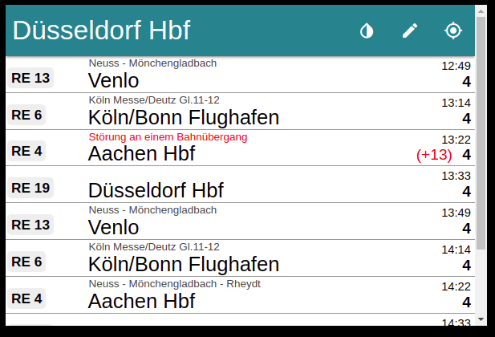
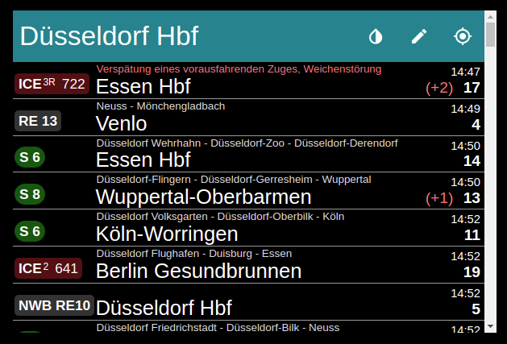
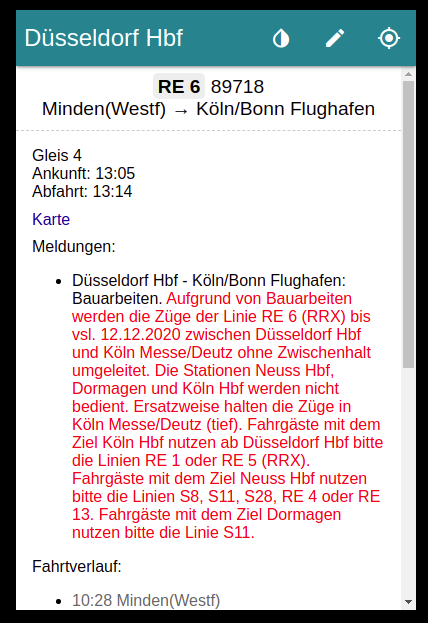
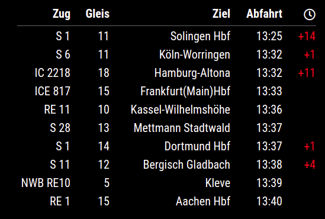

# MMM-DBF (Deutsche Bahn Frontend)
This is a module for the [MagicMirror²](https://github.com/MichMich/MagicMirror/).

Displays the next departure times and delays (with details) of Trains from any city and station in germany.

### App Theme

<p float="left">
  
   
</p>

### App Detail (after click on a train)
<p float="left">
  
   
</p>

### Table


## Installing the module
Clone this repository in your `~/MagicMirror/modules/`:

`git clone https://github.com/Helpi90/MMM-DBF`


To use this module, add the following configuration block to the modules array in the `config/config.js` file:
```js
var config = {
    modules: [
        {
            module: 'MMM-DBF',
            position: 'top_right',
            config: {
                showApp: false,
                station: "Düsseldorf Hbf",
                height:"600px",
                width:"400px",
            }
        }
    ]
}
```

## Configuration options for App and table

| **Option** | **Default**  | **Description** |
| --- | ---  | --- |
| `station` | `"Düsseldorf Hbf"`  | *Required* <br/>German Station Name [(Check possible name)](https://dbf.finalrewind.org/)
| `updateInterval` |  `60000` |*Optional* <br/>How often should the data be fetched. 
| `platform` | `' '` | *Optional* <br/> Only show platform. Supports multiple strings, separated by comma (",")
| `via` | `' '` | *Optional* <br/> Only show routs via. Supports multiple strings, separated by comma (",")
| `onlyArrivalTime` | `false` | *Optional* <br/> Boolean to show only ArrivalTime (at Station)
| `hideLowDelay` | `false` | *Optional* <br/> Boolean to hide delay smaller 5 min
<br/> 

## Configuration options only for App view
| **Option** | **Default**  | **Description** |
| --- | ---  | --- |
| `showApp` | `false` | *Required* <br/> Activate app view
| `height` | `600px` | *Optional* <br/> The height of the App
| `width` | `400px` | *Optional* <br/> The width of the App
| `showArrivalTime` | `false` | *Optional* <br/> Boolean to show arrival time too. 
| `showRealTime` | `false` | *Optional* <br/> Boolean to show real-time information instead of timetable data
<br/>

## Configuration options only for table view
| **Option** | **Default**  | **Description** |
| --- | ---  | --- |
| `numberOfResults` | `10` | *Optional* <br/> Number of results to be displayed
| `withoutDestination` | `''` | *Optional* <br/> Show results without destination. Supports multiple strings, separated by comma (","). (e.g. "Duisburg Hbf,Venlo" )
| `onlyDestination` | `''` | *Optional* <br/> Only show results wit destination. Supports multiple strings, separated by comma (","). (e.g. "Duisburg Hbf,Venlo" )
| `train` | `''` | *Optional* <br/> Only show trains that start with the given string. Supports multiple strings, separated by comma (","). (e.g. "RB33,S" )
| `setTableWidth` | `''` | *Optional* <br/> Sets the width of the table in pixel (e.g. "400px" )
| `timeOption` | `time` | *Optional* <br/> Changes the type of time <br/> (Options : `time` , `time+countdown` and `countdown`)
| `showDelayMsg` | `false` | *Optional* <br/> Boolean to show delay massages or not. 
