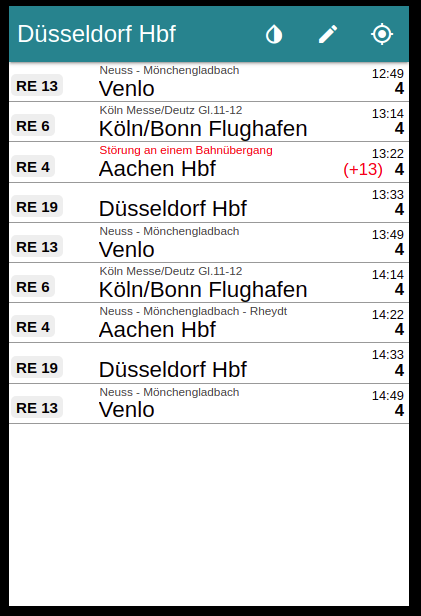

# MMM-VrrApp
This is a module for the [MagicMirror²](https://github.com/MichMich/MagicMirror/).

Displays the next departure times of Trains, subway and Buses from any city and station in the german federal state North Rhine-Westphalia (VRR).

### App Theme

<p float="left">
  
   
</p>

### App Detail (after click on a train)
<p float="left">
  
   
</p>

## Installing the module
Clone this repository in your `~/MagicMirror/modules/`:

`git clone https://github.com/Defjam121/MMM-VrrApp`


To use this module, add the following configuration block to the modules array in the `config/config.js` file:
```js
var config = {
    modules: [
        {
            module: 'MMM-VrrApp',
            position: 'top_right',
            config: {
                station: "Düsseldorf Hbf",
                height:"600px",
		        width:"400px",
            }
        }
    ]
}
```

## Configuration options

| **Option** | **Default** | **Description** |
| --- | --- | --- |
| `station` | `"Düsseldorf Hbf"` | *Required* <br/>German Station Name
| `updateInterval` |  `60000` |*Optional* <br/>How often should the data be fetched. 
| `platform` | `''` | *Optional* <br/> Only show platform. Supports multiple strings, separated by comma (",")
| `via` | `false` | *Optional* <br/> Only show routs via. Supports multiple strings, separated by comma (",")
| `height` | `600px` | *Optional* <br/> The height of the App
| `width` | `400px` | *Optional* <br/> The width of the App